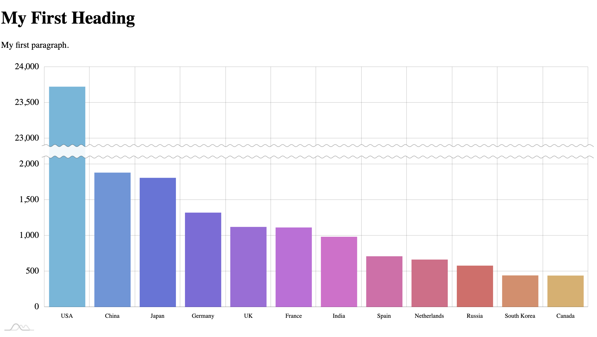
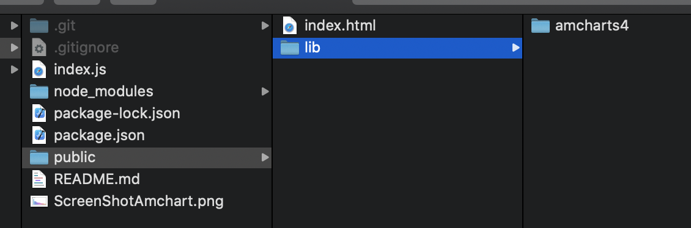

# nodejs102

1. pull [nodejs101](https://github.com/designerkenji/nodejs101) into a new folder. 
2. run npm install to recreate node_modules folder based on the dependencies in the package.json file
```js
npm install
```

 
 ### nodejs101  
 - we setup the web server using express package and create a public folder for all the static contents. 

 ### nodejs102  
 - we will focus in the public folder to setup the client side with amcharts  

 3. download [amcharts standalone JavaScript version](https://www.amcharts.com/download/)
 4. unzip and copy the amcharts4 folder to /public/lib/
 5. copy [amchart column chart sample code](https://www.amcharts.com/demos/column-chart-with-axis-break/) into to /public/index.html 
 6. inside index.html, change amchats js path from cdn to /static/lib/amcharts4/ folder.
 7. start the web server and visit http://localhost:3000/static/ in google chrome to view the sample column chart
  







